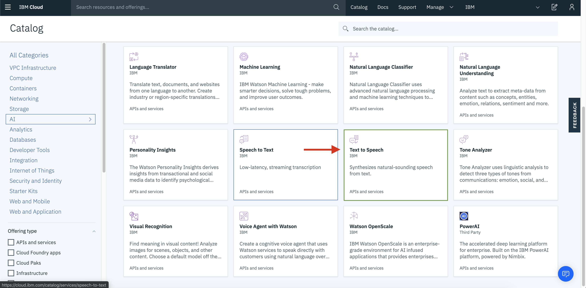

# Node-red workshop

This github repository is meant for learning how to setup and use node-red with IBM services on IBM cloud.

## Node-red overview. 

To avoid later confusions, the image below will give a quick overview on navigating in node red. take carefull note on the location of the **debug view**, since it will be referenced later.


## Prerequisites. 

Before we begin, we need to setup some services on IBM cloud, mainly *node-red community*, *Weather services* and *Watson Text To Speech*.

### Setting up node-red-community

#### Setup service.

To setup your service, go to IBM cloud, and click on "create resource" on the top of the page. 

In the search bar on the top of the page, write node-red. Choose the one which says "Community" below the name. 

You now have to choose the option which says "Cloudant". This will create a no-sql database along with your instance which will store your configurations and can be used for saving data from nodes. 


Afterwards the service might take a couple of minutes to start up. 

When your node-red instance is ready, click on the link which says "Visit App URL" next to the name. 


#### Configuring your node-red service.

When opening the node-red service for the first time, you will be prompted with a screen, asking you to create a username and password for your service. This is not mandatory, but highly recommended, since if you choose not to, your instance will be available publicly. 

After exiting the setup, you should be presented with a web-page with a large button. Click on the button to go to your node-red flow. 

#### Installing node-red dashboard.

When entering your workflow click on the menu at the top left of the screen, and click on *"Manage palette"*


a user settings panel should pop up (see above). From here, click on the install tab and search for node-red dashboard and click on the install button.

### Setting up text to speech and Weather services

The node-red service on IBM cloud comes with a variaty of integrations to IBM cloud services. In this tutorial, we have choosen to include Text to Speech and Weather integration, since these have different ways of connecting to node red, they are perfect for a tutorial.

To start of, open a new tab with IBM cloud in your browser and navigate to the "create resource" page like before.

On the panel on the left click on "AI" and choose the service called "Text to speech"

Choose the light plan, fill in the name and click "create".

When the instance is created, copy your API-key and URL from the **manage** page of the service. write this down for later.

for weather services, go back to "create resource" and create an instance with "Weather company data" like you did with Text to Speech before. When the instance is created, you need to go into **Service credentials** and click on the button which says "new credential".

From your new credentials, copy the username, password and host and save them for later.

 https://twcservice.au-syd.mybluemix.net/rest-api/#/

**lat**

55.735660

**long**

9.126420

## Setting up our dashboard.

Now that we have created all of the instances that we need, we can start creating components and displaying data from our node-red instance. 

### Showing weather data within the UI.

In your browser, go to your node-red service and scroll to the IBM Watson category in the menu to the left.


Above the IBM Watson category you should also see one called **weather** with a node called "weather insights" inside it. Drag it to the "flow" along with the Text to Speech IBM Watson node. 

we now need to start building our dashboard. Open up a new tab in your browser and go to {your-node-red-url}/ui you should be presented with the following screen: 


What you need to do is go to the button on the menu where you found your Text to speech and weather data nodes. Here you can find a category called **Dashboard**. Choose the button node and place it next to the weather insights node and connect the two nodes.


What happens now is that every time we click the button on the UI, the **weather insights** node will get triggered.

Now, before we can do this, we need to setup our dashboard. Double click on your button node and a menu will pop up.


This will bring up a menu from which we can configure the button. The only thing that we have to worry about for now is the tab at the top which says "Group". The Group dictates where and on which sub-page the button is situated in the interface. 

Click on the pencil next to the dropdown and you will be presented with another panel

Pick a name for your group (Home) and click on the pencil next to the Tab dropdown to create a new tab.


From here you can just click add, as the default values are fine for our example. When you return to the previous panel, you can click add again. And then on the last panel, click **Done**.

Now press **deploy** in the top right corner of node-red and go to your UI page. From here you should be able to see the button.

now go back to your node-red dashboard and double click on the **weather insight node** in the flow. Here you can paste in your **username**, **password** and **hostname** from before, under service, choose **current observations** for longitude and latitude use *55.735660,9.126420* which is the location of the legoland hotel in Billund Denmark.

now go to the top of the side menu in node red and drag the **debug** onto your flow and connect it to the other end of your weather insights. 


double click on the debug node and choose the complete msg object as output.


Now press **deploy**, go to your UI and press the button.

In the debug view, you should be able to see the payload from the weather insights node in json form. What we are interested in is the observation object, and inside it the temperature(**temp**) value.


Now go down and find the **Gauge** node from the **Dashboard** category in the side menu, drag it into your flow and connect it at the end of your **weather insights** node.


Double click on the **gauge** node, it should already be setup to your home tab, but we need to define it's input so it only displays the temperature data from our **msg.observations** object. This can be done by writing {{msg.observation.temp}} inside the **Value format** input.


press **deploy** again, go to the UI and click on the button. You should now see the temperature value displayed within the **gauge**.

### Setting up Text to Speech.

In this section we want to build a text input field in our UI which is able to read text. 

Start by dragging an **audio out** node from the dashboard category onto the dashboard and configure it as earlier. Then connect it to the end of your **Text to Speech** node as pictured below. 


Now double click on the **Text to Speech** node and a configuration window should appear. Inside the window you need to fill out the following fields

**Username**: this is simply "apikey"

**Password**: The API key you copied earlier

**API Key**: The API key you copied earlier as well

**Service Endpoint**: The URL you copied from earlier.

**Language**: English

------

As you can see inside the configuration of the **Text to Speech** node, there is no choice of extracting the payload like there was in the gauge. This means that before we can convert text to speech, we first need to parse the data which comes in to the node.

Towards the top of the left menu you will find a category called **function** with a node of the same name, drag this onto your flow and connect it to the start of your **text to speech node**. 

Now double click on the function node and paste in the following

```
let pl = {"payload":"The current temperature is " + msg.observation.temp + " degrees"}

return pl;
```

This should make it so whenever we get the weather from our service, the result should also be read aloud by our assistant.

Now connect the function node to your weather service as pictured below.


Now as before, deploy your setup and go to your UI and press the button, you should now get the current temperature read out loud.

