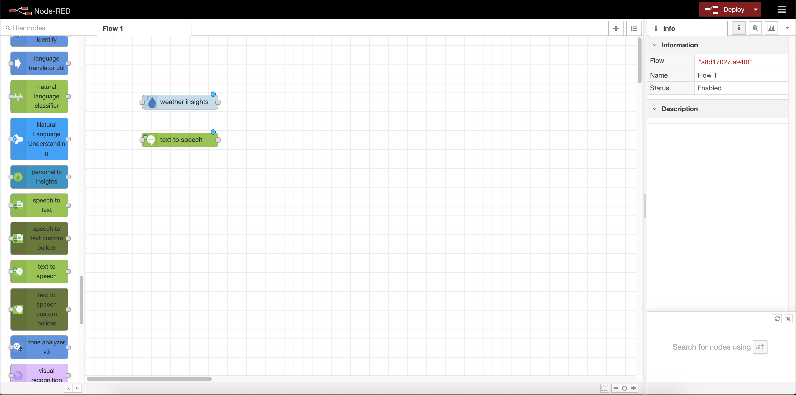

# Node-red workshop

This github repository is meant for learning how to setup and use node-red with IBM services on IBM cloud.

[TOC]


## Prerequisites. 

Before we begin, we need to setup some services on IBM cloud, mainly *node-red community*, *Weather services* and *Watson Text To Speech*.

### Setting up node-red-community

#### Setup service.

Go to: https://cloud.ibm.com/

To setup your service, go to IBM cloud, and click on "create resource" on the top of the page. 

In the search bar on the top of the page, write node-red. Choose the one which says "Community" below the name. 


You now have to choose the option which says "Cloudant". This will create a no-sql database along with your instance which will store your configurations and can be used for saving data from nodes. 


Afterwards the service might take a couple of minutes to start up. 

When your node-red instance is ready, you will be redirected to your new Node-Red instance, click on the link that says "Visit App URL" next to the name. 


## Configuring your node-red service.

When opening the node-red service for the first time, you will be prompted with a screen, asking you to create a username and password for your service. This is not mandatory, but highly recommended, since if you choose not to, your instance will be available publicly. 

After the setup, you should be presented with a web-page with a large button that says: "Go to your Node-RED flow editor". Click on the button to go to your node-red flow. 

#### Installing node-red dashboard.

Node-red dashboard lets you create GUIs in a flash, we will need it later so let's install it:

When entering your workflow click on the menu at the top right of the screen, and click on *"Manage palette"*

A user settings panel should pop up. From here, click on the **install tab** and search for **node-red dashboard** and click on the install button.


## Setting up text to speech and Weather services

The node-red service on IBM cloud comes with a variaty of integrations to IBM cloud services. In this tutorial, we have choosen to include Text to Speech and Weather integration, since these have different ways of connecting to node red, they are perfect for a tutorial.

To start of, open a new tab with IBM cloud in your browser and navigate to the "create resource" page like before.

On the panel on the left click on "AI" and choose the service called "Text to speech"

Choose the lite plan, fill in the name and click "create".

When the instance is created, copy your API-key and URL from the **manage** page of the service. write this down for later.

for weather services, go back to "create resource" and create an instance with "**Weather company data**" like you did with Text to Speech before. When the instance is created, you need to go into **Service credentials** and click on the button which says "new credential".

From your new credentials, copy the username, password and host and save them for later.


## Setting up our dashboard and showing weather data.

Now that we have created all of the instances that we need, we can start creating components and displaying data from our node-red instance. 

In your browser, go to your node-red service and scroll to the IBM Watson category in the menu to the left.


Above the IBM Watson category you should also see one called **weather** with a node called "weather insights" inside it. Drag it to the "flow" along with the Text to Speech IBM Watson node. 

we now need to start building our dashboard. Open up a new tab in your browser and go to {your-node-red-url}/ui you should be presented with the following screen: 

e.g.: 

***Yes***: "volaris-test.eu-gb.cf.appdomain.cloud**/ui/**"

*No*: "volaris-test.eu-gb.cf.appdomain.cloud/red/#flow/8297de68.c20e4**/ui/**"


This is the screen where our dashboard will be displayed. It is empty for now, but you will begin to see results as soon as you start adding dashboard components to your flow. 

Go back to your node-red flow and go to the bottom of the menu where you found your **Text to speech** and **weather data** nodes. Here you can find a category called **Dashboard**. Choose the button node and place it next to the weather insights node and connect the two nodes.


What happens now is that every time we click the button on the UI, the **weather insights** node will get triggered.

Now, before we can do this, we need to setup our dashboard. Double click on your button node and a menu will pop up.


This will bring up a menu from which we can configure the button. The only thing that we have to worry about for now is the tab at the top which says "Group". The Group dictates where and on which sub-page the button is situated in the interface. 


Click on the pencil next to the dropdown and you will be presented with another panel.

now pick a name for your group (Home) and click on the pencil next to the Tab dropdown to create a new tab.


From here you can just click add, as the default values are fine for our example. When you return to the previous panel, you can click add again. And then on the last panel, click **Done**.


Now press **deploy** in the top right corner of node-red and go to your UI page. From here you should be able to see the button.

now go back to your node-red dashboard and double click on the **weather insights node** in the flow. Here you can paste in your **username**, **password** and **hostname** from before. As service, choose **current observations** for longitude and latitude use *55.735660,9.126420* which is the location of the legoland hotel in Billund Denmark.

now go to the top of the side menu in node red and drag the **debug** onto your flow and connect it to the other end of your weather insights.


double click on the debug node and choose the complete msg object as output.


Now press **deploy**, go to your UI and press the button.

In the debug view, you should be able to see the payload from the weather insights node in JSON form. What we are interested in is the observation object, and inside it the temperature(**temp**) value.


Now go down and find the **Gauge** node from the **Dashboard** category in the side menu, drag it into your flow and connect it at the end of your **weather insights** node.


Double click on the **gauge** node, it should already be setup to your home tab, but we need to define it's input so it only displays the temperature data from our **msg.observations** object. This can be done by writing {{msg.observation.temp}} inside the **Value format** input.


press **deploy** again, go to the UI and click on the button. You should now see the temperature value displayed within the **gauge**.

### Individual exercise 1

- Right now your gauge goes from 0 to 10, can you change it so the gauge goes from -10 to 50?
- Try out different types of gauges? How would it look if it was donut shaped instead?

## Setting up Text to Speech.

In this section we want to build a text input field in our UI which is able to read text. 

Start by dragging an **audio out** node from the dashboard category onto the dashboard and configure it as earlier. Then connect it to the end of your **Text to Speech** node as pictured below. 


Now double click on the **Text to Speech** node and a configuration window should appear. Inside the window you need to fill out the following fields

**Username**: this is simply "apikey"

**Password**: The API key you copied earlier

**API Key**: The API key you copied earlier as well

**Service Endpoint**: The URL you copied from earlier.

**Language**: English

------

As you can see inside the configuration of the **Text to Speech** node, there is no choice of extracting the payload like there was in the gauge. This means that before we can convert text to speech, we first need to parse the data which comes in to the node.

Towards the top of the left menu you will find a category called **function** with a node of the same name, drag this onto your flow and connect it to the start of your **text to speech node**. 

Now double click on the function node and paste in the following

```
let pl = {"payload":"The current temperature in " + msg.observation.obs_name +"is " + msg.observation.temp + " degrees"}

return pl;
```

This should make it so whenever we get the weather from our service, the result should also be read aloud by our assistant. *"msg.observation.obs_name"* also gives us the name of the city which the weather is displayed from. 

Now connect the function node to your weather service as pictured below.


Now as before, deploy your setup, go to your UI and press the button, you should now get the current temperature read out loud.

## Collecting user input

In this section we will look at how we can store user data in our database as well as fetch it and display it in our UI.

We will start by dragging a **Form** node from the dashboard category into our workflow. 


Double click on the form and look in the input field which says "*Form elements*" add three elements to your form. These should look as pictured below

Also, add another **Group** called "userform" in the **home** tab.

Now, whenever we push the submit button on this form, we want to store it in our cloudant database.

Go to the side menu and under the storage category, choose the ***"cloudant out"*** node. Drag the node into your flow and connect it to your form node.

Double click on the **cloudant out node**. The cloudant instance we created when we created node-red should already be connected to the service, all you have to do is choose it from the *Service* dropdown. The specific name of the database is not important since it will be created for you upon first inserting, but there needs to be a name in the field. you also have to choose ***insert*** as the operation (see below). 

Whenever we get a new input from the database, we want to be able to get it out and display it, to get the data from the database, we use the ***cloudant in*** node. drag it on to your flow and double click it like before. This time you want **search by all documents**.

attach the **cloudant in** node to your form and attach a **debug** node to the end of it to see what is returned. 

the database part of your flow should now look something like below

now deploy your flow and go to your UI, then fill out your form and go back and look at the result in the debug screen.

**Did you notice something wrong?**

The problem is that the database is read at the same time as data is being inserted (or maybe even before) which means that we do not get the newest data. 

To avoid this we can place a delay node between the form and the **Cloudant in** node.

a delay on the node of 1 second should be sufficient, depending on your internet speed. 

After doing this you should be able to see updated data inside the debug window

## Challenges

**Challenge 1**

Now that you have gotten some basic insight into how to use node red with node-red-dashboard, we want you to display the fetched data inside the dashboard in a way which makes sense. Take a look at the nodes in the dashboard category and notice if any of them will be helpfull to you. will you be able to use a gauge like before?

 

 (Hint: you need to use a **function** node to parse the data from the database). If you are not a big fan of javascript, you can get some inspiration from the following code snippet

```
var payload= {msg: msg.payload};
let returnArr = {msg:[]}

for(let n of payload.msg){
    returnArr.msg.push(`Traveling from ${n.payload.From} to ${n.payload.To} at ${n.payload.Time}`)
}

return returnArr
```

**Challenge 2**

We now want to ask you to display some kind of data from your database. Be it how many people travel from a specific location, the time they travel or a whole other kind of value. Feel free to use any kind of display method you wish. 


## Solutions to challenges.

**Challenge 1**

Import the following into your node-red instance. remember to set it up with your own UI and database.

```json
[{"id":"db7295d9.d40178","type":"tab","label":"Flow 2","disabled":false,"info":""},{"id":"ea480c83.7ab54","type":"ui_form","z":"db7295d9.d40178","name":"","label":"","group":"c778880c.970e38","order":3,"width":0,"height":0,"options":[{"label":"To","value":"To","type":"text","required":true},{"label":"From","value":"From","type":"text","required":true},{"label":"Time","value":"Time","type":"date","required":true}],"formValue":{"To":"","From":"","Time":""},"payload":"","submit":"submit","cancel":"cancel","topic":"","x":130,"y":200,"wires":[["b717265b.f893f8","e0eb191e.82c008"]]},{"id":"b717265b.f893f8","type":"cloudant out","z":"db7295d9.d40178","name":"","cloudant":"","database":"userdata","service":"testInstance-cloudantNoSQLDB","payonly":false,"operation":"insert","x":320,"y":200,"wires":[]},{"id":"d8cddd0b.4ce4c","type":"cloudant in","z":"db7295d9.d40178","name":"","cloudant":"","database":"userdata","service":"testInstance-cloudantNoSQLDB","search":"_all_","design":"","index":"","x":500,"y":260,"wires":[["16da785e.e26648","73bff70b.aa1aa8"]]},{"id":"e0eb191e.82c008","type":"delay","z":"db7295d9.d40178","name":"","pauseType":"delay","timeout":"1","timeoutUnits":"seconds","rate":"1","nbRateUnits":"1","rateUnits":"second","randomFirst":"1","randomLast":"5","randomUnits":"seconds","drop":false,"x":320,"y":260,"wires":[["d8cddd0b.4ce4c"]]},{"id":"16da785e.e26648","type":"function","z":"db7295d9.d40178","name":"","func":"var payload= {msg: msg.payload};\nlet returnArr = {msg:[]}\n\nfor(let n of payload.msg){\n    returnArr.msg.push(`Traveling from ${n.payload.From} to ${n.payload.To} at ${n.payload.Time}`)\n}\n\nreturn returnArr","outputs":1,"noerr":0,"x":660,"y":260,"wires":[["73bff70b.aa1aa8","d8b33586.7ecb48"]]},{"id":"73bff70b.aa1aa8","type":"debug","z":"db7295d9.d40178","name":"","active":true,"tosidebar":true,"console":false,"tostatus":false,"complete":"false","x":810,"y":180,"wires":[]},{"id":"6827701b.1d745","type":"comment","z":"db7295d9.d40178","name":"Show the data from the database in the UI","info":"","x":560,"y":160,"wires":[]},{"id":"d8b33586.7ecb48","type":"ui_template","z":"db7295d9.d40178","group":"71b965cc.2834ac","name":"","order":4,"width":"6","height":"9","format":"<div ng-bind-html=\"msg.msg\"></div>","storeOutMessages":true,"fwdInMessages":true,"templateScope":"local","x":840,"y":280,"wires":[[]]},{"id":"c778880c.970e38","type":"ui_group","z":"","name":"User form","tab":"61bffc36.30d754","disp":true,"width":"6","collapse":false},{"id":"71b965cc.2834ac","type":"ui_group","z":"","name":"Home","tab":"61bffc36.30d754","disp":true,"width":"6","collapse":false},{"id":"61bffc36.30d754","type":"ui_tab","z":"","name":"Home","icon":"dashboard","disabled":false,"hidden":false}]
```

**Challenge 2**

The code below will display how many people travel from Vejle in a gauge inside the UI.

```JSON
[{"id":"1e38808d.9a226f","type":"ui_form","z":"a8d17027.a940f","name":"","label":"","group":"c778880c.970e38","order":3,"width":0,"height":0,"options":[{"label":"To","value":"To","type":"text","required":true},{"label":"From","value":"From","type":"text","required":true},{"label":"Time","value":"Time","type":"date","required":true}],"formValue":{"To":"","From":"","Time":""},"payload":"","submit":"submit","cancel":"cancel","topic":"","x":90,"y":560,"wires":[["f93c8288.df61a","3e9b95c8.458d3a"]]},{"id":"f93c8288.df61a","type":"cloudant out","z":"a8d17027.a940f","name":"","cloudant":"","database":"userdata","service":"testInstance-cloudantNoSQLDB","payonly":false,"operation":"insert","x":280,"y":560,"wires":[]},{"id":"24656d87.9dd302","type":"cloudant in","z":"a8d17027.a940f","name":"","cloudant":"","database":"userdata","service":"testInstance-cloudantNoSQLDB","search":"_all_","design":"","index":"","x":460,"y":620,"wires":[["c44f03bd.9f9e1","11afe1d7.e465fe"]]},{"id":"3e9b95c8.458d3a","type":"delay","z":"a8d17027.a940f","name":"","pauseType":"delay","timeout":"1","timeoutUnits":"seconds","rate":"1","nbRateUnits":"1","rateUnits":"second","randomFirst":"1","randomLast":"5","randomUnits":"seconds","drop":false,"x":280,"y":620,"wires":[["24656d87.9dd302"]]},{"id":"c44f03bd.9f9e1","type":"function","z":"a8d17027.a940f","name":"","func":"var payload= {msg: msg.payload};\nlet returnArr = {}\n\nfor(let n of payload.msg){\n    if(n.payload.From in returnArr){\n        returnArr[n.payload.From] += 1\n    }\n    else{\n        returnArr[n.payload.From] = 1;\n    }\n}\n\nreturn returnArr","outputs":1,"noerr":0,"x":620,"y":620,"wires":[["11afe1d7.e465fe","e42cfb70.da0a78"]]},{"id":"11afe1d7.e465fe","type":"debug","z":"a8d17027.a940f","name":"","active":true,"tosidebar":true,"console":false,"tostatus":false,"complete":"false","x":770,"y":540,"wires":[]},{"id":"4ddc2f31.2b732","type":"comment","z":"a8d17027.a940f","name":"How many people travel from Vejle?","info":"","x":520,"y":540,"wires":[]},{"id":"e42cfb70.da0a78","type":"ui_gauge","z":"a8d17027.a940f","name":"","group":"71b965cc.2834ac","order":3,"width":0,"height":0,"gtype":"gage","title":"gauge","label":"units","format":"{{msg.Vejle}}","min":0,"max":10,"colors":["#00b500","#e6e600","#ca3838"],"seg1":"","seg2":"","x":780,"y":620,"wires":[]},{"id":"c778880c.970e38","type":"ui_group","z":"","name":"User form","tab":"61bffc36.30d754","disp":true,"width":"6","collapse":false},{"id":"71b965cc.2834ac","type":"ui_group","z":"","name":"Home","tab":"61bffc36.30d754","disp":true,"width":"6","collapse":false},{"id":"61bffc36.30d754","type":"ui_tab","z":"","name":"Home","icon":"dashboard","disabled":false,"hidden":false}]
```

